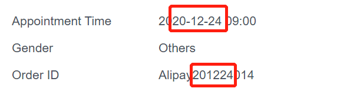

# [Transaction List](https://alipaycn.yuansfer.com/#/master/alipayamslist)

---
* 交易列表是按照`付款时间`排序的，可以通过transaction ID(交易通知邮件和Appointment Info中均可以找到订单号)精确查询到交易记录。
* 鼠标点击交易列表右边`More` 可以查看交易详细信息，进行退款等操作。
* 右上角Download可以保存交易列表数据以共使用。

# [Appointment Info](https://alipaycn.yuansfer.com/#/master/alipayDateList)

---
* 预约信息列表是根据`预约日期和时间进行排序`，因此在使用Order ID查询预约信息是需要留意`左上角日期`筛选框所选时间范围。
* 列表上方 Order ID, Email, User Name, Phone 四个输入框均可用于查询指定预约信息，例如用户使用同一个邮箱成功预约3次检查，
那么我们可以通过Email 查询到这3比预约记录。
* Transaction No即为上面所提到Transaction List中左上方筛选框输入内容:Transaction ID.

# 预约号(Order Id)含义

---

Order Id中数字部分前6个数字依次表示用户预约日期中两位年份，两位月份，两位日期。后3位为标识号。
所以，用户展示Order ID之后我们就能知道他是预约哪一天做检测。

